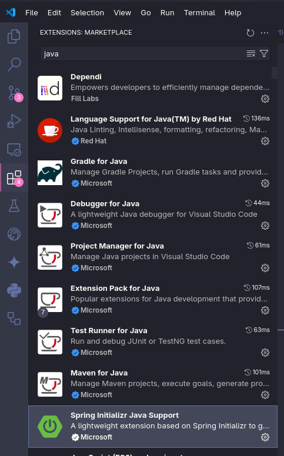
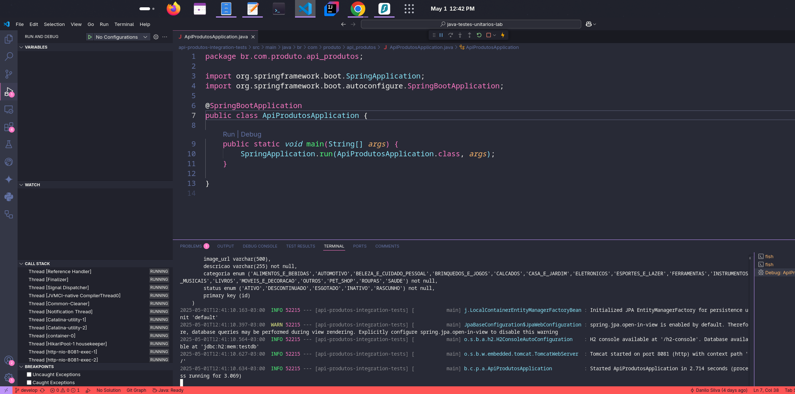

# Java Testes Unitários Lab

Este repositório contém exemplos de testes unitários em Java, utilizando ferramentas como JUnit e Spring Boot. Abaixo estão algumas capturas de tela que demonstram os resultados dos testes, a configuração do ambiente e uma visão geral da execução.

---

## 3. Visão Geral da Execução dos Testes (`overview`)

A imagem a seguir apresenta uma visão geral da execução dos testes, incluindo o status de sucesso ou falha:

---

## 1. Resultados de Cobertura de Testes (`coverage_result`)

A imagem abaixo mostra os resultados dos testes Java, destacando o percentual de cobertura de cada classe no projeto:

---

## 4. Cenários de Teste Executados (`suite_tests`)

Abaixo está a lista de classes e cenários de teste executados, com o status de cada teste:

---

## 2. Plugins Java no VS Code (`java plugins`)

Abaixo está a lista de plugins Java utilizados no Visual Studio Code para configurar o ambiente de desenvolvimento:

---

## 2. Plugins Java no VS Code (`java plugins`)

Aplicação em execução :)

